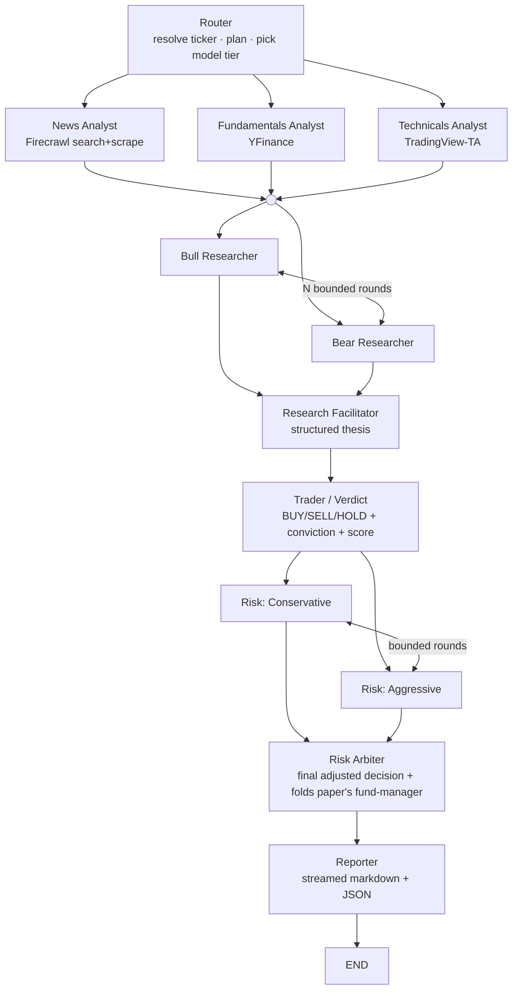

# FinResearchAI — Agentic Upgrade Design Spec

- **Date:** 2026-05-29
- **Status:** Approved design (no implementation yet)
- **Author:** Prateek Mulye (with Claude Code)
- **Scope:** Re-architect the existing LangGraph stock-research demo into an evaluated, debate-driven multi-agent system for an EU job-market portfolio.

## 1. Goals & Positioning

| Decision | Choice |
|---|---|
| Portfolio positioning | **Agentic systems engineer** — multi-agent orchestration, debate topology, structured state are the headline |
| Ambition | **Ambitious re-architecture** — adopt the strong `TradingAgents` mechanisms + fix structural debt |
| LLM backbone | **Ollama Cloud only** (provider-agnostic abstraction; OpenAI/Anthropic swappable by config) |
| Memory | **State-first** typed fields + **embedded Chroma** cache (zero paid keys, reproducible) |
| Evaluation | **Debate A/B + cost/latency** harness (the angle that out-rigors the paper) |
| Web research | **Firecrawl** (search + full-page scrape) replaces Tavily |
| Deploy / UI | **FastAPI streaming backend + thin SSE UI**, shipped as a **Docker HF Space** |
| Target agent topology | **Approach A + small risk debate** (12 nodes) |

**Success criteria.** A reviewer can clone, set two API keys (`OLLAMA_API_KEY`, `FIRECRAWL_API_KEY`), run end-to-end on first try, watch the debate stream live, and read an eval report that *measures* whether the multi-agent debate beats a single-pass baseline on quality vs. cost. The codebase reads like current (2026) agentic-engineering practice: structured outputs, async streaming, real tests, honest observability.

## 2. Background

The current app (assessment in `../00-codebase-assessment.md`) scores ~47/100. It is a competent demo with real defects: hand-rolled JSON parsing instead of structured outputs, observability that is wired in `.env` but not in code (403 spam), Pinecone used as the inter-agent message bus (write-then-read race), incorrect `main.py` stream accumulation, dead tests, hardcoded `gpt-4o-mini`, and no evaluation layer.

The reference paper (analysis in `../01-paper-analysis.md`) is **TradingAgents: Multi-Agents LLM Financial Trading Framework** (UCLA/MIT/Tauric, arXiv 2412.20138v7). We adopt a deliberate **subset** of its mechanisms and explicitly improve on three of its weaknesses (no debate ablation; ignored cost/latency; under-specified reflection).

## 3. Target Agent Topology



**12 nodes** (current: 6). New: bull, bear, research-facilitator, trader, 2 risk personas, risk-arbiter. The paper's separate *fund manager* node is **folded into the risk arbiter** (flagged low-value in the paper analysis). Both debates run **bounded rounds** (config-capped, default 1–2) to keep cost/latency sane.

### Mechanisms adopted from the paper (subset)
- **M2 Bull/Bear debate + facilitator** — the headline, recognizable feature.
- **M4 Risk debate** — kept as a *small* conservative↔aggressive debate with an arbiter (not the paper's 3-agent team).
- **M6 Structured state protocol** — research flows through typed state, not a vector pool.
- **M3 Actionable signal** — trader emits BUY/SELL/HOLD + conviction.
- **M7 Quick/deep model routing** — cheap models for analysts, deep models for debate/verdict.

### Deliberately skipped / simplified
- Paper's 3-agent risk *team* → 2 personas + arbiter.
- Paper's separate fund-manager node → folded into arbiter.
- Paper's 4-way analyst split → keep 3 analysts (news/fundamentals/technicals); news/sentiment split is now cheap with Firecrawl full-text but deferred.
- Reflective memory (M8) → stretch goal only, and only if grounded in realized outcomes.
- Full backtest (M9) → out of scope; replaced by the debate A/B + cost harness.

## 4. State Model

Research payloads flow agent→agent through **typed `AgentState` fields** (Pydantic models), produced via `with_structured_output`. No string-scraping of JSON. Pinecone-as-bus is removed.

| Field | Written by | Shape |
|---|---|---|
| `ticker, resolved_ticker, screener, exchange, investor_mode` | Router | control |
| `model_plan` | Router | tier (quick/deep) per phase |
| `analyst_reports` | analysts | `dict[name → {summary, key_points[], data{}, confidence, citations[]}]` |
| `research_debate` | bull/bear/facilitator | `{rounds[], bull_thesis, bear_thesis, facilitator_verdict}` |
| `trade_proposal` | trader | `{action, conviction, score 0-100, rationale}` |
| `risk_debate` | risk nodes | `{conservative, aggressive, arbiter_decision, adjustments[]}` |
| `final_decision` | arbiter | `{action, conviction, score, rationale}` |
| `final_report` | reporter | markdown |
| `run_metrics` | all (reducer) | `{tokens, cost_usd, latency_s, per_node[]}` |

The embedded vector store (Chroma) becomes a **cross-run cache + future reflection log only** — never the live message bus. Cache freshness uses **deterministic metadata queries**, not semantic similarity.

## 5. Cross-Cutting Layers

### 5.1 LLM layer (provider-agnostic, Ollama Cloud default)
- `llm/factory.py` → `get_llm(tier)` returns a **cached, module-level** `ChatOpenAI` pointed at `base_url=https://ollama.com/v1` with `OLLAMA_API_KEY`. Ollama Cloud is OpenAI-compatible (verified). Module-level singletons fix the per-node object-churn defect.
- Two tiers (config-driven, `config/models.yaml`):
  - `quick` (analysts, retrieval, formatting): default `gpt-oss:20b` or `gemma3:27b`.
  - `deep` (bull/bear debate, trader verdict, risk arbiter): default `gpt-oss:120b` or `deepseek-v3.2` / `kimi-k2-thinking`.
- Provider swap (OpenAI/Anthropic) = config change only.
- All structured outputs via Pydantic schemas in `llm/schemas.py`.

### 5.2 Memory
- Typed state is the primary channel (§4).
- **Embedded Chroma** (`memory/store.py`) for cross-run verdict cache; freshness via metadata query.
- **Embeddings:** default **local `fastembed` (BGE-small, CPU, no key)** for full reproducibility. ⚠️ *Open decision for impl:* verify whether Ollama Cloud serves `/v1/embeddings`; if it does and is desirable, switch via config. Default stays local/key-free.
- `memory/reflection.py` (stretch): store past verdict + realized forward return, feed back into future decisions.

### 5.3 Evaluation & observability
- **`obs/recorder.py`** — `RunRecorder` callback captures per-node input/output/tokens/latency → JSONL trace + surfaced `run_id`. LangSmith **off by default** (kills 403 theater); auto-enabled only when a valid key is present.
- **Cost/latency** aggregated into `run_metrics` (tokens, $, seconds, per-node) and surfaced in report + API response.
- **Debate A/B harness (`eval/`)** — config flag `debate_mode: on|off`. *Off* collapses bull/bear/facilitator to a single-pass verdict. Harness runs the same ticker set both ways and compares: verdict agreement, score spread, **agreement-with-a-deep-judge-model** (`eval/judge.py`), and cost/latency delta → markdown+JSON eval report (`eval/report.py`).
- **Honest framing:** this measures verdict quality/cost, **not** realized P&L (no backtest). Stating this explicitly is itself a quality signal and the core "we ablated what the paper didn't" contribution.

### 5.4 Web research — Firecrawl
- `tools/firecrawl.py` via `firecrawl-py`. News Analyst uses `/v2/search` to discover sources, then `/v2/scrape` for full-article markdown (richer than snippet search → better sentiment extraction).
- Replaces Tavily entirely; `langchain-tavily`/`tavily-python` dropped.
- Key: `FIRECRAWL_API_KEY` (verified working).

### 5.5 Backend & deploy
- Async end-to-end (async nodes, async LLM calls).
- **FastAPI** (`api/main.py`): `POST /analyze` streams node-by-node + token deltas via **SSE** (LangGraph `astream`, `stream_mode="updates"/"messages"`) — debate unfolds live. Plus `GET /healthz`, `GET /runs/{id}`.
- **Thin frontend** (`web/`) consumes SSE (HTMX/vanilla or Gradio-as-client).
- Ship as **Docker HF Space** (not the Gradio SDK Space).
- **Redis** (already provisioned, currently unused) → optional rate-limit + response cache + run store; defaults to in-memory.

## 6. Repository Structure (target)

```
src/
  config/      settings.py (pydantic-settings) · models.yaml
  llm/         factory.py · schemas.py · cost.py
  state.py
  graph.py     async StateGraph, 12 nodes
  agents/      router · analysts/{news,fundamentals,technicals}
               · research/{bull,bear,facilitator} · trader
               · risk/{conservative,aggressive,arbiter} · reporter
  memory/      store.py · embeddings.py · reflection.py*
  tools/       firecrawl.py · yfinance.py · tradingview.py
  eval/        harness.py · judge.py · report.py
  obs/         recorder.py
  api/         main.py · stream.py
web/           thin SSE frontend
tests/         pytest + mocked LLM/tools     evals/  reports + ticker sets
Dockerfile · pyproject.toml (pinned) · .env.example      (* = stretch)
```

## 7. Out of Scope (YAGNI)
- Full historical backtest / P&L simulation (M9).
- Paper's 3-agent risk team and separate fund manager.
- 4-way analyst split (news/sentiment) — deferred, cheap to add later.
- Live trading, brokerage integration, real-money anything.
- Reflective memory unless grounded in realized outcomes (stretch).

## 8. Risks & Open Decisions
1. **Embeddings source** — confirm Ollama Cloud embeddings vs. local fastembed at impl start (default: local).
2. **Deep-model latency/cost on Ollama Cloud** — bounded debate rounds + tier routing mitigate; measure in the harness.
3. **A/B quality proxy** — no ground-truth returns; judge-model agreement is a proxy, framed honestly.
4. **TradingView-TA rate limits** — retain the existing exchange-fallback retry; add backoff.
5. **HF Space Docker deploy** — heavier than Gradio SDK; validate resource limits early.
6. **API keys are temporary** — `OLLAMA_API_KEY` and `FIRECRAWL_API_KEY` are dev keys to be rotated post-deploy; never commit them.

## 9. Companion Documents
- `../00-codebase-assessment.md` — full audit of the current code, scores, run results.
- `../01-paper-analysis.md` — TradingAgents decomposition, mapping, critiques.
- `../02-skills-and-tools.md` — skills/tools matrix.
- `../03-work-breakdown.md` — phased work packages for the dev subagents.
